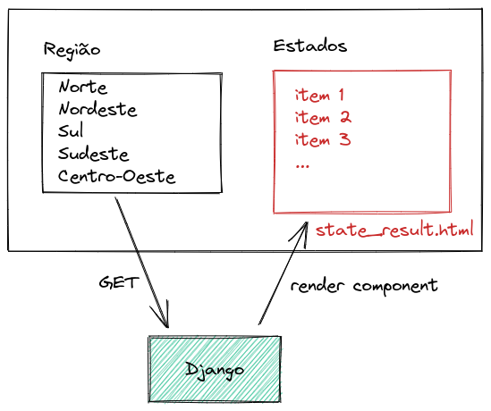
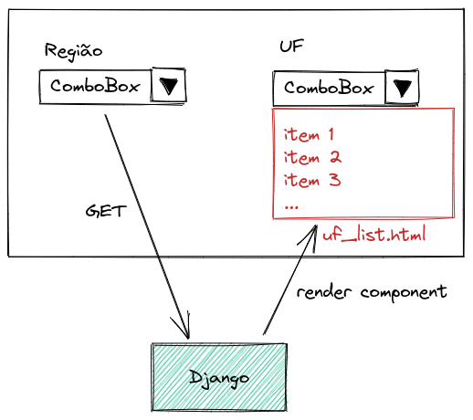

# django-htmx-tutorial

Tutorial sobre como trabalhar com [Django](https://www.djangoproject.com/) e [htmx](https://htmx.org/).


## Este projeto foi feito com:

* [Python 3.9.6](https://www.python.org/)
* [Django 3.2.*](https://www.djangoproject.com/)
* [htmx](https://htmx.org/)

## Como rodar o projeto?

* Clone esse repositório.
* Crie um virtualenv com Python 3.
* Ative o virtualenv.
* Instale as dependências.
* Rode as migrações.

```
git clone https://github.com/rg3915/django-htmx-tutorial.git
cd django-htmx-tutorial
python -m venv .venv
source .venv/bin/activate
pip install -r requirements.txt
python contrib/env_gen.py
python manage.py migrate
python manage.py createsuperuser --username="admin" --email=""
python manage.py runserver
```

## Exemplos

* [Filtrar várias tabelas com um clique](#filtrar-v%C3%A1rias-tabelas-com-um-clique)




* [Filtrar com dropdowns dependentes](#filtrar-com-dropdowns-dependentes)




* [Adicionar itens](#adicionar-itens)


* [Pagar (editar) vários itens (Bulk Update)](#pagar-editar-vários-itens-bulk-update)


* [Editar um item](#editar-um-item)


* [Deletar um item](#deletar-um-item)


* [client-side-templates](#client-side-templates)


## Passo a passo

### Clonando o projeto base

```
git clone https://github.com/rg3915/django-htmx-tutorial.git
cd django-htmx-tutorial
git checkout passo-a-passo

python -m venv .venv
source .venv/bin/activate

pip install -U pip
pip install -r requirements.txt
pip install ipdb

python contrib/env_gen.py

python manage.py migrate
python manage.py createsuperuser --username="admin" --email=""

python manage.py runserver
```


Em `base.html` escreva

```html
<!-- HTMX -->
<script src="https://unpkg.com/htmx.org@1.5.0"></script>
<script src="https://unpkg.com/htmx.org@1.5.0/dist/ext/client-side-templates.js"></script>
<script src="https://cdn.jsdelivr.net/npm/mustache@4.2.0/mustache.min.js"></script>
```

Em `nav.html` escreva

```html
<li class="nav-item">
  <a class="nav-link" href="">Estados</a>
</li>
<li class="nav-item">
  <a class="nav-link" href="{ url 'expense:expense_list' %}">Despesas</a>
</li>
<li class="nav-item">
  <a class="nav-link" href="{ url 'expense:expense_client' %}">Despesas (Client side)</a>
</li>
```

Corrija o link em `index.html`

```html
<a href="">Estados</a>
```


## Exemplos

### Filtrar várias tabelas com um clique


Considere a app `state`.

Em `state/views.py` escreva

```python
# state/views.py
from django.shortcuts import render

from .states import states


def state_list(request):
    template_name = 'state/state_list.html'

    regions = (
        ('n', 'Norte'),
        ('ne', 'Nordeste'),
        ('s', 'Sul'),
        ('se', 'Sudeste'),
        ('co', 'Centro-Oeste'),
    )

    context = {'regions': regions}
    return render(request, template_name, context)
```

Em `state/urls.py` escreva

```python
# state/urls.py
from django.urls import path

from backend.state import views as v

app_name = 'state'


urlpatterns = [
    path('', v.state_list, name='state_list'),
    path('result/', v.state_result, name='state_result'),
]

```

Crie as pastas

```
mkdir -p state/templates/state
```


Escreva o template

`touch state/templates/state/state_list.html`

```html
<!-- state/templates/state/state_list.html -->



<h1>Regiões e Estados do Brasil</h1>

<h2 style="color: #3465a4;">Filtrando várias tabelas com um clique</h2>

<div class="row">

  <div class="col">
    <table class="table table-hover">
      <thead>
        <tr>
          <th>Região</th>
        </tr>
      </thead>
      <tbody>
        
        <tr
          hx-get="?region={{region.0}}"
          hx-target="#states"
        >
          <td>
            <a>{{ region.1 }}</a>
          </td>
        </tr>
        
      </tbody>
    </table>
  </div>

  <div class="col">
    <table class="table">
      <thead>
        <tr>
          <th>Estados</th>
        </tr>
      </thead>
      <tbody id="states">
        <!-- O novo conteúdo será inserido aqui. -->
      </tbody>
    </table>
  </div>

</div>

```

Em `state/views.py` escreva

```python
# state/views.py
def get_states(region):
    return [state for state in states.get(region).items()]

def state_result(request):
    template_name = 'state/state_result.html'
    region = request.GET.get('region')

    ufs = {
        'n': get_states('Norte'),
        'ne': get_states('Nordeste'),
        's': get_states('Sul'),
        'se': get_states('Sudeste'),
        'co': get_states('Centro-Oeste'),
    }

    context = {'ufs': ufs[region]}
    return render(request, template_name, context)
```

Escreva o template

`touch state/templates/state/state_result.html`

```html
<!-- state/templates/state/state_result.html -->

  <tr>
    <td>{{ uf.1 }}</td>
  </tr>

```

---

### Filtrar com dropdowns dependentes


Edite `state/urls.py`

```python
# state/urls.py
...
path('uf/', v.uf_list, name='uf_list'),
...
```

Edite `state/views.py`

```python
# state/views.py
def uf_list(request):
    template_name = 'state/uf_list.html'
    region = request.GET.get('region')

    ufs = {
        'n': get_states('Norte'),
        'ne': get_states('Nordeste'),
        's': get_states('Sul'),
        'se': get_states('Sudeste'),
        'co': get_states('Centro-Oeste'),
    }

    context = {'ufs': ufs[region]}
    return render(request, template_name, context)
```

Edite

`touch state/templates/state/uf_list.html`

```html
<!-- state/uf_list.html -->

  <option value="{{ uf.0 }}">{{ uf.1 }}</option>

```

Edite `state/templates/state/state_list.html`

```html
<h2 style="color: #3465a4;">Filtro com dropdowns dependentes</h2>

<div class="row">

  <div class="col">
    <label>Região</label>
    <select
      name="region"
      class="form-control"
      hx-get=""
      hx-target="#uf"
    >
      <option value="">-----</option>
      
        <option value="{{ region.0 }}">{{ region.1 }}</option>
      
    </select>
  </div>

  <div class="col">
    <label>UF</label>
    <select
      id="uf"
      class="form-control"
    >
      <option value="">-----</option>
      <!-- O novo conteúdo será inserido aqui. -->
    </select>
  </div>

</div>

<hr>

...
```

Descomente em `urls.py`

```
path('state/', include('backend.state.urls', namespace='state')),
```

---

### A base para despesas

Considere o desenho a seguir:


`expense_result.html` será inserido em
`expense_table.hmtl`, que por sua vez
será inserido em `expense_list.html`.

Sendo que `expense_result.html` será repetido várias vezes por causa do laço de repetição em `expense_table.hmtl`.

---

### Adicionar itens


Escreva o `expense/models.py`

```python
# expense/models.py
from django.db import models

from backend.core.models import TimeStampedModel


class Expense(TimeStampedModel):
    description = models.CharField('descrição', max_length=30)
    value = models.DecimalField('valor', max_digits=7, decimal_places=2)
    paid = models.BooleanField('pago', default=False)

    class Meta:
        ordering = ('description',)
        verbose_name = 'despesa'
        verbose_name_plural = 'despesas'

    def __str__(self):
        return self.description
```

Escreva o `expense/admin.py`

```python
# expense/admin.py
from django.contrib import admin

from .models import Expense


@admin.register(Expense)
class ExpenseAdmin(admin.ModelAdmin):
    list_display = ('__str__', 'value', 'paid')
    search_fields = ('description',)
    list_filter = ('paid',)
```

Escreva o `expense/forms.py`

```python
# expense/forms.py
from django import forms

from .models import Expense


class ExpenseForm(forms.ModelForm):
    required_css_class = 'required'

    class Meta:
        model = Expense
        fields = ('description', 'value')
        widgets = {
            'description': forms.TextInput(attrs={'placeholder': 'Descrição', 'autofocus': True}),
            'value': forms.NumberInput(attrs={'placeholder': 'Valor'}),
        }

    def __init__(self, *args, **kwargs):
        super(ExpenseForm, self).__init__(*args, **kwargs)
        for field_name, field in self.fields.items():
            field.widget.attrs['class'] = 'form-control'
```

Escreva o `expense/views.py`

```python
# expense/views.py
from django.http import JsonResponse
from django.shortcuts import render
from django.views.decorators.http import require_http_methods

from .forms import ExpenseForm
from .models import Expense


def expense_list(request):
    template_name = 'expense/expense_list.html'
    form = ExpenseForm(request.POST or None)

    expenses = Expense.objects.all()

    context = {'object_list': expenses, 'form': form}
    return render(request, template_name, context)


@require_http_methods(['POST'])
def expense_create(request):
    form = ExpenseForm(request.POST or None)

    if form.is_valid():
        expense = form.save()

    context = {'object': expense}
    return render(request, 'expense/expense_result.html', context)
```

Escreva o `expense/urls.py`

```python
# expense/urls.py
from django.urls import path

from backend.expense import views as v

app_name = 'expense'


urlpatterns = [
    path('', v.expense_list, name='expense_list'),
    path('create/', v.expense_create, name='expense_create'),
]
```

Escreva o `expense/expense_list.html`

```html
<!-- expense/expense_list.html -->
<!-- expense_list.html -->



<h1>Lista de Despesas</h1>
<div class="row">
  <div class="col">
    <form
      class="form-inline p-3"
      hx-post=""
      hx-target="#expenseTbody"
      hx-indicator=".htmx-indicator"
      hx-swap="afterbegin"
    >
      
      
      <div class="form-group p-2">
        {{ field }}
        {{ field.errors }}
        
        <small class="text-muted">{{ field.help_text|safe }}</small>
        
      </div>
      
      <div class="form-group">
        <button
          type="submit"
          class="btn btn-primary ml-2"
        >Adicionar</button>
      </div>
    </form>
  </div>
</div>

<div
  id="checkedExpenses"
  class="col pt-2"
>
  <form>
    <table class="table">
      <thead>
        <tr>
          <th></th>
          <th>Descrição</th>
          <th>Valor</th>
          <th class="text-center">Pago</th>
          <th class="text-center">Ações</th>
        </tr>
      </thead>
      <tbody id="expenseTbody">
        
      </tbody>
    </table>
  </form>
</div>




<script>
document.body.addEventListener('htmx:configRequest', (event) => {
  event.detail.headers['X-CSRFToken'] = '{{ csrf_token }}';
});
</script>

```

Escreva o `expense/expense_table.html`

```html
<!-- expense_table.html -->

  

```

Escreva o `expense/expense_result.html`

```html
<!-- expense_result.html -->
<tr
  hx-target="this"
  hx-swap="outerHTML"
  class="person activatedeactivate"
>
  <td>
    <input
      type="checkbox"
      name="ids"
      value="{{ object.pk }}"
    >
  </td>
  <td>{{ object.description }}</td>
  <td>{{ object.value }}</td>
  <td class="text-center">
    
    <span>
      <i class="fa fa-check-circle ok"></i>
    </span>
    
    <span>
      <i class="fa fa-times-circle no"></i>
    </span>
    
  </td>
</tr>
```


---

### Pagar (editar) vários itens (Bulk Update)


Escreva o `expense/views.py`

```python
@require_http_methods(['POST'])
def expense_paid(request):
    ids = request.POST.getlist('ids')

    # Edita as despesas selecionadas.
    Expense.objects.filter(id__in=ids).update(paid=True)

    # Retorna todas as despesas novamente.
    expenses = Expense.objects.all()

    context = {'object_list': expenses}
    return render(request, 'expense/expense_table.html', context)


@require_http_methods(['POST'])
def expense_no_paid(request):
    ids = request.POST.getlist('ids')

    # Edita as despesas selecionadas.
    Expense.objects.filter(id__in=ids).update(paid=False)

    # Retorna todas as despesas novamente.
    expenses = Expense.objects.all()

    context = {'object_list': expenses}
    return render(request, 'expense/expense_table.html', context)
```

Escreva o `expense/urls.py`

```python
path('expense/paid/', v.expense_paid, name='expense_paid'),
path('expense/no-paid/', v.expense_no_paid, name='expense_no_paid'),
```

Escreva o `expense/expense_list.html`

```html
<!-- expense_list.html -->
<div
  class="col"
  hx-include="#checkedExpenses"
  hx-target="#expenseTbody"
>
  <a
    class="btn btn-outline-success"
    hx-post=""
  >Pago</a>
  <a
    class="btn btn-outline-danger"
    hx-post=""
  >Não Pago</a>
  <span class="lead"><strong>Bulk update</strong></span>
</div>
```

---

### Editar um item


Escreva o `expense/views.py`

```python
# expense/views.py
def expense_detail(request, pk):
    template_name = 'expense/expense_detail.html'
    obj = Expense.objects.get(pk=pk)
    form = ExpenseForm(request.POST or None, instance=obj)

    context = {'object': obj, 'form': form}
    return render(request, template_name, context)


def expense_update(request, pk):
    template_name = 'expense/expense_result.html'
    obj = Expense.objects.get(pk=pk)
    form = ExpenseForm(request.POST or None, instance=obj)
    context = {'object': obj}

    if request.method == 'POST':
        if form.is_valid():
            form.save()

    return render(request, template_name, context)
```


Escreva o `expense/urls.py`

```python
# expense/urls.py
path('<int:pk>/', v.expense_detail, name='expense_detail'),
path('<int:pk>/update/', v.expense_update, name='expense_update'),
```

Escreva o `expense/expense_result.html`

```html
<!-- expense/expense_result.html -->
<td class="text-center">
    <span hx-get="">
      <i class="fa fa-pencil-square-o link span-is-link"></i>
    </span>
  </td>
```


Escreva o `expense/expense_detail.html`

```html
<!-- expense_detail.html -->
<tr id="trExpense">
  <td></td>
  <td>{{ form.description }}</td>
  <td>{{ form.value }}</td>
  <td></td>
  <td class="text-center">
    <button
      type="submit"
      class="btn btn-success"
      hx-post=""
      hx-target="#trExpense"
      hx-swap="outerHTML"
    >
      OK
    </button>
    <button
      class="btn btn-danger"
      hx-get=""
      hx-target="#trExpense"
      hx-swap="outerHTML"
    >
      <i class="fa fa-close"></i>
    </button>
  </td>
</tr>
```

---

### Deletar um item


Escreva o `expense/views.py`

```python
# expense/views.py
@require_http_methods(['DELETE'])
def expense_delete(request, pk):
    obj = Expense.objects.get(pk=pk)
    obj.delete()
    return render(request, 'expense/expense_table.html')
```

Escreva o `expense/urls.py`

```python
# expense/urls.py
path('<int:pk>/delete/', v.expense_delete, name='expense_delete'),
```

Escreva o `expense/expense_result.html`

```html
<!-- expense/expense_result.html -->
<td class="text-center">
    ...
    <span
      hx-delete=""
      hx-confirm="Deseja mesmo deletar?"
      hx-target="closest tr"
      hx-swap="outerHTML swap:500ms"
    >
      <i class="fa fa-trash no span-is-link pl-2"></i>
    </span>
  </td>
```

---

### client-side-templates

https://htmx.org/extensions/client-side-templates/

```python
# expense/models.py

class Expense(TimeStampedModel):
    ...
    def to_dict(self):
        return {
            'id': self.id,
            'description': self.description,
            'value': self.value,
            'paid': self.paid,
        }
```

Escreva o `expense/views.py`

```python
# expense/views.py
def expense_json(self):
    expenses = Expense.objects.all()
    data = [expense.to_dict() for expense in expenses]
    return JsonResponse({'data': data})


def expense_client(request):
    template_name = 'expense/expense_client.html'
    return render(request, template_name)
```

Escreva o `expense/urls.py`

```python
# expense/urls.py
...
path('json/', v.expense_json, name='expense_json'),
path('client/', v.expense_client, name='expense_client'),
```

Escreva o `expense/expense_client.html`

```html
<!-- expense_client.html -->



<h1>Lista de Despesas (Client side)</h1>
<h3>Consumindo API Rest</h3>

<div hx-ext="client-side-templates">
  <button
    class="btn btn-primary"
    hx-get=""
    hx-swap="innerHTML"
    hx-target="#content"
    mustache-template="foo"
  >
    Clique para carregar os dados
  </button>

  <table class="table">
    <thead>
      <tr>
        <th>Descrição</th>
        <th>Valor</th>
        <th class="text-center">Pago</th>
      </tr>
    </thead>
    <tbody id="content">
    </tbody>
    <template id="foo">
      <!-- Mustache looping -->
      { #data }
      <tr>
        <td>{ description }</td>
        <td>{ value }</td>
        <td class="text-center">
          <!-- Mustache conditional -->
          <!-- http://mustache.github.io/mustache.5.html#Inverted-Sections -->
          { #paid } <i class="fa fa-check-circle ok"></i> { /paid }
          { ^paid } <i class="fa fa-times-circle no"></i> { /paid }
        </td>
      </tr>
      { /data }
    </template>

  </table>
</div>




<script>
  // https://github.com/janl/mustache.js/#custom-delimiters
  Mustache.tags = ['{', '}'];
</script>

```

**Atenção:** tentar resolver o problema de [cors-headers](https://github.com/adamchainz/django-cors-headers).


### Json Server

#### Instalação

```
npm install -g json-server
```

Crie um `db.json`

```
{
  "expenses": {
    "data": [
      { "description": "Lanche", "value": 20, "paid": true },
      { "description": "Conta de luz", "value": 80, "paid": false },
      { "description": "Refrigerante", "value": 5.5, "paid": true }
    ]
  }
}
```

#### Server

```
json-server --watch db.json
```

Escreva o `index.html`

```html
<!-- index.html -->
<!DOCTYPE html>
<html lang="en">
<head>
  <meta charset="utf-8">
  <meta http-equiv="X-UA-Compatible" content="IE=edge">
  <meta name="viewport" content="width=device-width, initial-scale=1.0, shrink-to-fit=no">
  <link rel="shortcut icon" href="https://www.djangoproject.com/favicon.ico">
  <title>htmx</title>

  <!-- Bootstrap core CSS -->
  <link rel="stylesheet" href="https://stackpath.bootstrapcdn.com/bootstrap/4.4.1/css/bootstrap.min.css">

  <!-- Font-awesome -->
  <link rel="stylesheet" href="https://maxcdn.bootstrapcdn.com/font-awesome/4.7.0/css/font-awesome.min.css">

  <!-- HTMX -->
  <script src="https://unpkg.com/htmx.org@1.5.0"></script>
  <script src="https://unpkg.com/htmx.org@1.5.0/dist/ext/client-side-templates.js"></script>
  <script src="https://cdn.jsdelivr.net/npm/mustache@4.2.0/mustache.min.js"></script>

  <style>
    .no {
      color: red;
    }
    .ok {
      color: green;
    }
  </style>
</head>
<body>
  <h1>Lista de Despesas (Client side)</h1>
<h3>Consumindo API Rest</h3>

<div hx-ext="client-side-templates">
  <!-- http://localhost:8000/expense/json/ -->
  <button
    class="btn btn-primary"
    hx-get="http://localhost:8000/expense/json/"
    hx-swap="innerHTML"
    hx-target="#content"
    mustache-template="foo"
  >
    Clique para carregar os dados
  </button>

  <table class="table">
    <thead>
      <tr>
        <th>Descrição</th>
        <th>Valor</th>
        <th class="text-center">Pago</th>
      </tr>
    </thead>
    <tbody id="content">
    </tbody>
    <template id="foo">
      <!-- Mustache looping -->
      {{ #data }}
      <tr>
        <td>{{ description }}</td>
        <td>{{ value }}</td>
        <td class="text-center">
          <!-- Mustache conditional -->
          <!-- http://mustache.github.io/mustache.5.html#Inverted-Sections -->
          {{ #paid }} <i class="fa fa-check-circle ok"></i> {{ /paid }}
          {{ ^paid }} <i class="fa fa-times-circle no"></i> {{ /paid }}
        </td>
      </tr>
      {{ /data }}
    </template>

  </table>
</div>
</body>
</html>
```